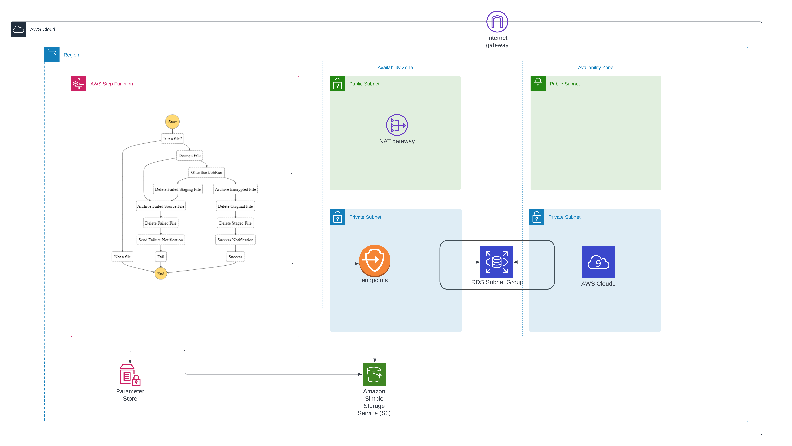

# ETL Pipeline with AWS Step Functions

This pattern explain how to build a serverless  ETL pipeline to validate, transform, compress, 
and partition large csv dataset for performance and cost optimization. 
The pipeline is orchestrated by serverless AWS Step Functions with error handling, retry and end user notification.
When a csv file is uploaded to AWS S3 (Simple Storage Service) Bucket source folder, ETL pipeline is triggered. 
The pipeline validates the content and the schema of the source csv file, transform csv file to compressed parquet format, 
partition the dataset with year/month/day  and store in a transformed folder for  analytics tools to consume.

---

## Sections
- [Prerequisites](#Prerequisites)
- [Limitations](#Limitations)
- [Product Versions](#Product-Versions)
- [Architecture](#Architecture)
- [High level work flow](#High-level-work-flow)
- [Repository Structure](#Repository-Structure)
- [Deploy](#Deploy)
- [Test](#Test)

## Prerequisites 

* An active AWS account with programmatic access
* AWS CLI with AWS account configuration, so that you can create AWS resources by deploying CloudFormation  stack
* Amazon S3 bucket 
* CSV dataset with correct schema ( attached is a sample csv file with correct schema and data type)
* Web browser
* AWS Glue console access
* AWS Step Functions console access

## Limitations
AWS Step Functions:

- Parameter Store secure strings - Can't be uploaded using Cloud Formation at time of writing. Needs to be done manually. 

## Product Versions
* Python 3 for AWS Lambda
* Java 11 for AWS Lambda
* AWS Glue version 3

## Architecture

## High level work flow

1. User uploads a csv file. AWS EventBridge event triggers a Step Function 
2. Choice determines whether or not it is a valid file
3. Glue Job starts and upserts file data
4. Original file is archived
5. Original file is deleted
6. Unencrypted file is deleted

## Repository Structure
- template.yml - CloudFormation template file
- parameter.json - File that contains all the parameters and their respective values. This file needs to be updated to change the parameter value as described below
- myLayer - This folder contains python packages needed to create the required lambda layer for this project
- lambda - This folder contains the following lambda function
   - s3object.py - Creates required directory structure inside S3 bucket
- encrypt-decrypt-file - This folder contains the encrypt/decrypt function

## Deploy
This pattern can be deployed through AWS CloudFormation template.

Follow the below step to deploy this pattern using CloudFormation template file [template.yml](template.yml) included in this repository.

1. Clone the Repo
2. Navigate to the Directory
3. Update parameter.json file as follows - 
    - pS3BucketName - Unique bucket name. This bucket will be created to store all the dataset. As, S3 Bucket name is globally unique, provide a unique name.
    - pEmailforNotification - A valid email address to receive success/error notification.
    - pSourceFolder - Folder name (inside bucket created mentioned in 3.a) where source csv file will be uploaded inside 
    - pStageFolder - Folder name (inside bucket created mentioned in 3.a) used to staging area for AWS Glue Jobs 
    - pArchiveFolder - Folder name (inside bucket created mentioned in 3.a) where source csv file will be archived 
    - pErrorFolder - Folder name (inside bucket created mentioned in 3.a) where source csv file will be moved for any error 
    - pTenants - Tenant subfolders to create in the above folders
    - pEnvironmentName - Environment name
    - pDBName - DB name
    - pMasterUsername - RDS username
    - pMasterPassword - RDS password

5. Execute the following AWS CLI command with pre-configured AWS CLI profile. 
    - Replace "unique_name" with a valid bucket unique identifier
   
   aws cloudformation package --template-file template.yml --s3-bucket artifact-staging-<unique name> --output-template-file packaged.template

   aws cloudformation deploy --stack-name StepFunctionsExample --template-file packaged.template  --parameter-overrides file://parameter.json --capabilities CAPABILITY_IAM
6. Check the progress of CloudFormation stack deployment in console and wait for it to finish

## Test

1. Once, stack deployment is completed, navigate to source folder inside S3 bucket ( which was provided in Step 3a above)
2. Upload a sample encrypted csv file with valid schema ( a sample file employee.csv.pgp is attached) to trigger the ETL Pipeline through AWS Step Functions
3. Check the ETL pipeline status in the AWS Step Functions console
4. Once ETL pipeline completes, the uploaded file will be in the archive folder
5. Optionally, Amazon Athena can be used for adhoc query on the partitioned/transformed dataset

---

## License
This library is licensed under the MIT-0 License. See the LICENSE file.

